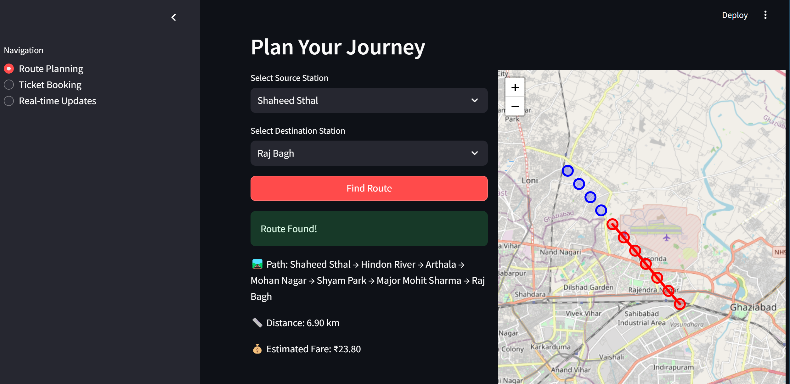

# Delhi Metro Route Planner

## Overview

The **Delhi Metro Route Planner** is an interactive application built using Python's Tkinter library. It provides users with features to plan metro routes, check real-time station statuses, view train arrivals, and book tickets. The application also offers a visually appealing and modern GUI for an enhanced user experience.

## Features

### 1. Route Planning
- Users can input a source and destination station to calculate the shortest path and fare.
- Implements Dijkstra's algorithm for finding the shortest route.
- Displays the calculated route, total distance, and fare.

### 2. Ticket Booking
- Allows users to book tickets by entering their details (name, phone number, and email).
- Provides a confirmation message with ticket details after successful booking.

### 3. Metro Map
- Displays a high-resolution map of the Delhi Metro in a zoomable and scrollable interface.

### 4. Real-Time Data Simulation
- Simulates real-time train arrivals and station statuses.
- Updates data dynamically at regular intervals.

## Technologies Used

- **Python**: Core programming language.
- **Tkinter**: For GUI development.
- **Pillow**: To handle and display the Delhi Metro map image.

## Installation

1. Clone this repository:
   ```bash
   git clone https://github.com/yourusername/delhi-metro-planner.git
   ```
2. Navigate to the project directory:
   ```bash
   cd delhi-metro-planner
   ```
3. Install the required dependencies:
   ```bash
   pip install pillow
   ```

## Usage

1. Run the application:
   ```bash
   python metro_app.py
   ```
2. Use the tabs for different functionalities:
   - **Route Planning Tab**: Input source and destination stations.
   - **Ticket Booking Tab**: Enter user details to book tickets.
3. Click on "Show Delhi Metro Map" to view the metro map.

## Project Structure

- `metro_app.py`: Main application code.
- `delhi_metro_map.jpeg`: Map image of the Delhi Metro.
- `README.md`: Project documentation.

## Screenshots

### 1. Main Interface


### 2. Metro Map


## Future Enhancements

- Integrate with real-time APIs for live train and station data.
- Add support for multiple languages.
- Implement a mobile-friendly version.

## License

This project is licensed under the MIT License. See the LICENSE file for details.

## Acknowledgments

- **Tkinter** documentation for GUI development.
- Delhi Metro for station and route data.

---

Feel free to fork this repository and contribute to its development. Happy coding!
